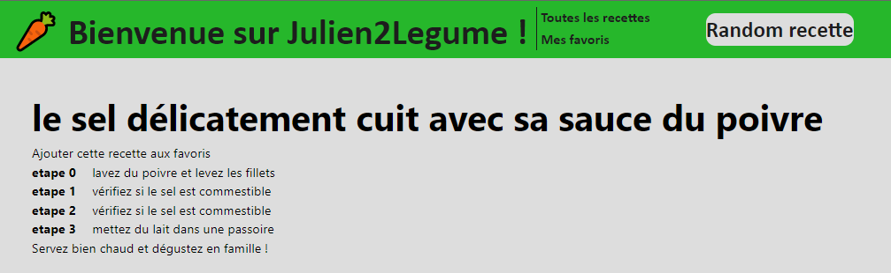

Julien2Legume est un site web qui permet de générer des recettes aléatoire, et de se créer un compte pour les ajouter en favoris

( PHP 8.03 symfony cli v4.23.5 et windows 11 (tout disfonctionnement du à Linux ou Macosne sera pas pris en charge, merci d'installer windows 11 pour lance ce programme dans les meilleures conditions ))

Voici les étapes à réaliser pour l'install

1-composer install

2-php bin/console d:s:u --force

3-php bin/console d:f:l

4-php -S 0.0.0.0:8000 -t public

